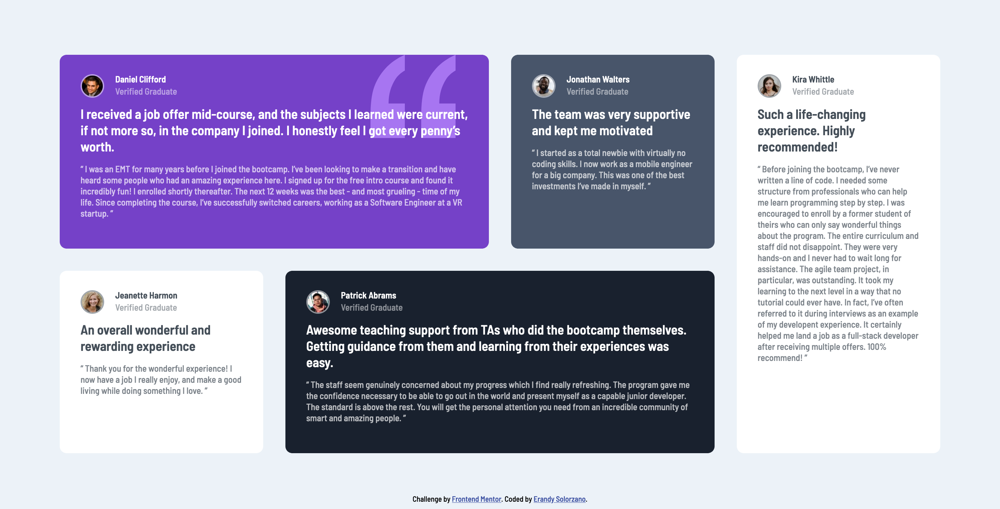

# Frontend Mentor - Testimonials grid section solution

This is a solution to the [Testimonials grid section challenge on Frontend Mentor](https://www.frontendmentor.io/challenges/testimonials-grid-section-Nnw6J7Un7). Frontend Mentor challenges help you improve your coding skills by building realistic projects. 

## Table of contents

- [Overview](#overview)
  - [The challenge](#the-challenge)
  - [Screenshot](#screenshot)
  - [Links](#links)
- [My process](#my-process)
  - [Built with](#built-with)
  - [What I learned](#what-i-learned)
- [Author](#author)

## Overview

### The challenge

This challenge was to build a testimonials grid section and get it looking as close to the design as possible.

Also the users should be able to view the website acording to ther device: mobile or desktop.


### Screenshot

Here's the screenshot for the desktop version


And here's the sreenshot for the mobile version 


### Links

- Solution URL: [Add solution URL here](https://your-solution-url.com)
- Live Site URL: [Add live site URL here](https://your-live-site-url.com)

## My process

### Built with


- Semantic HTML5 markup
- CSS custom properties
- Flexbox
- CSS Grid


### What I learned

I finally put into practices my grid kwnoledge. 
The hardest thing I found was placing the quotes image behind the text, for which I used position absolute and z-index, problably there are more lines than it should be: 

``` css
.daniel-rectangle {
    position: relative;
}

#quote {
    position: absolute;
    top: 0px;
    right: 2rem;
    border-radius: 0%;
    border: none;
    align-self: center;
    margin-right: 1rem;
    height: 120px;
    z-index: 1;
    max-height: 120px;
    max-width: 150px;
}

.z-index-top {
    position: relative;
    z-index: 2;
}

```


## Author

- GitHub - [@erandysuxx](https://github.com/erandysuxx)
- Frontend Mentor - [@erandysuxx](https://www.frontendmentor.io/profile/erandysuxx)
- Twitter - [@erandysuxx](https://twitter.com/erandysuxx)
- Instagram - [@erandysuxx](https://instagram.com/erandysuxx?igshid=YmMyMTA2M2Y=)


